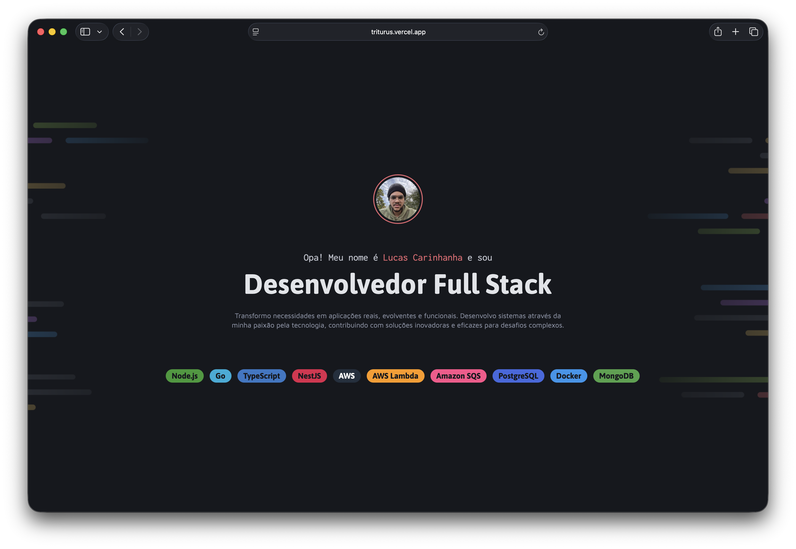

# Triturus

> Triturus é um género de anfíbios pertencente à família Salamandridae, presente em grande parte da Europa, Ásia Menor e parte ocidental da Rússia.

> Portfólio pessoal em Vue 3 com Vite e TypeScript, com seção de apresentação, tags de tecnologias e cards de projetos, pronto para deploy estático na Vercel.


---



---

## Visão Geral

O Triturus é uma landing page/portfólio pessoal construída com foco em apresentação visual e organização de conteúdo.

Hoje o projeto possui:

- Hero principal com foto de perfil, texto de apresentação e destaque do cargo
- Lista de tecnologias em formato de tags coloridas
- Seção de projetos em destaque com cards reutilizáveis
- Componentes atômicos e organizados por nível de responsabilidade
- Estilo escuro com identidade visual própria e background personalizado

---

## Stack Tecnológica

### Frontend

- Vue 3
- TypeScript
- Vite
- CSS puro

### Infra / Deploy

- Vercel
- Assets estáticos em `public/`

### Fontes

- Asap
- Inconsolata
- Maven Pro

---

## Estrutura do Projeto

```bash
.
├── index.html
├── package.json
├── public
│   └── background_Intro.png
├── screenshot.png
├── src
│   ├── App.vue
│   ├── app.css
│   ├── main.ts
│   ├── reset.css
│   ├── style.css
│   └── components
│       ├── atoms
│       │   ├── Tag.vue
│       │   └── tag.ts
│       └── organisms
│           ├── ProjectCard.vue
│           └── projectCard.ts
└── README.md
```

---

## Pré-requisitos

- Node.js 18+
- npm

---

## Instalação

```bash
npm install
```

---

## Como Rodar em Desenvolvimento

```bash
npm run dev
```

Aplicação local:

- http://localhost:5173

---

## Build

```bash
npm run build
```

Para visualizar o build localmente:

```bash
npm run preview
```

---

## Componentes Principais

### `Tag`

Componente atômico para exibir tecnologias com cor associada.

- Suporta os tamanhos `small` e `large`
- Usa um catálogo interno de tecnologias para definir a cor de fundo
- Ideal para exibir stack técnica e badges visuais

### `ProjectCard`

Componente de card para apresentação de projetos.

- Mostra imagem, título, descrição e tags
- Reaproveita o componente `Tag`
- Organiza os conteúdos em layout horizontal

---

## Conteúdo da Página

A interface principal é dividida em duas áreas:

- Header com apresentação pessoal e tecnologias em destaque
- Main com seção de projetos em destaque

O visual usa:

- Fundo escuro com contraste forte
- Tags coloridas para destacar cada tecnologia
- Tipografia expressiva para identidade de portfólio

---

## Deploy na Vercel

Este projeto é compatível com deploy estático na Vercel.

Observações importantes:

- Imagens colocadas em `public/` devem ser acessadas com caminho absoluto, por exemplo: `/background_Intro.png`
- O build final é gerado pelo Vite com `npm run build`
- O diretório de saída padrão é `dist/`

---

## Autor

Lucas Carinhanha

- GitHub: https://github.com/car1nhanha

---

Feito com código, café e cuidado visual.
